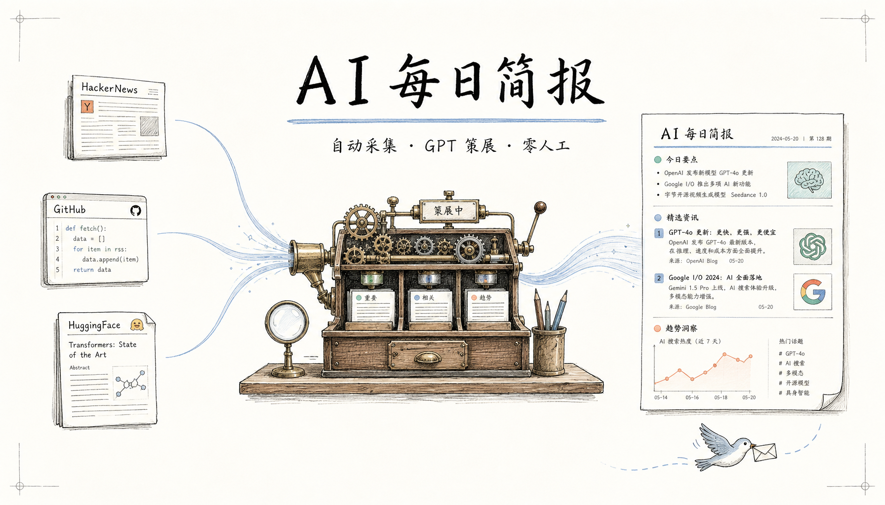

<div align="center">



# 🤖 AI Daily Brief

**不做信息搬运工，做有观点的策展人**

每日从 6 大数据源（含 9 个 RSS 订阅）采集 150+ 条 AI / 开发者资讯<br>经过两阶段 GPT 策展，输出 10 条精选 + 编辑评论

[](https://github.com/statefulai/ai-daily-brief/actions/workflows/daily-news.yml)
[](https://python.org)
[](LICENSE)

**[📰 查看今日简报](./daily-brief.md)** · **[📚 往期归档](./archives/)**

</div>

> 💡 **什么是"策展"？** 借鉴艺术展策展人（curator）的工作方式 — 从大量素材中选出最有价值的，编排成有结构的展览。这里指 GPT 扮演"主编"角色：对新闻打分、聚类、选稿、写评论，而不是简单的 RSS 搬运。

---

## 📷 效果预览

<details open>
<summary><strong>每日简报 (daily-brief.md)</strong></summary>

每日简报包含 5 个板块：

| 板块 | 说明 |
|------|------|
| 📌 **今日焦点** | 1 条最重要的新闻，附 3-5 句深度编辑评论 + 延伸来源 |
| 🔥 **热点速览** | 5-8 条精选，每条附编辑观点 |
| 🛠️ **今日工具** | 1-2 个值得关注的开源项目/工具 |
| 💡 **今日洞察** | AI 提炼的每日金句 |
| 📎 **延伸阅读** | 候选池中未入选的条目 |

👉 [查看今日简报示例](./daily-brief.md)

</details>

<details>
<summary><strong>飞书群推送卡片</strong></summary>

每天 08:30（北京时间）自动推送到飞书群，交互卡片格式，支持一键跳转完整简报。

配置方式见下方 [📱 飞书推送](#-飞书推送可选) 章节。

</details>

---

## 🚀 快速开始

### 1. 克隆 & 安装

```bash
git clone https://github.com/statefulai/ai-daily-brief.git
cd ai-daily-brief
python -m venv .venv && source .venv/bin/activate
pip install -r requirements.txt
```

### 2. 配置 API Key

```bash
cp .env.example .env
```

编辑 `.env`，填入 OpenAI 兼容 API 的 Key：

```env
OPENAI_API_KEY=sk-your-key-here
OPENAI_BASE_URL=https://api.openai.com/v1    # 或其他兼容端点
```

### 3. 运行

```bash
# 完整 pipeline（采集 + 策展 + 输出）
python main.py

# 仅拉取数据源，不调用 LLM
python main.py --sources-only

# 预览策展结果（不写入文件）
python main.py --dry-run

# 使用自定义配置文件
python main.py --config my-config.yaml
```

---

## 💡 为什么用它

| | RSS 订阅器 | 手动整理 | **AI Daily Brief** |
|---|:---:|:---:|:---:|
| 数据来源 | 自选 feed | 手动浏览 | **6 源（含 9 个 RSS）自动采集** |
| 筛选方式 | 全部展示 | 人工判断 | **GPT 两阶段打分 + 聚类** |
| 编辑观点 | ❌ 无 | ✅ 有（耗时） | ✅ **每条附 AI 编辑评论** |
| 去重 / 聚合 | ❌ 同新闻多次出现 | 人工去重 | ✅ **topic_key 自动聚合** |
| 来源多样性 | 依赖订阅偏好 | 依赖个人习惯 | ✅ **单源 ≤5 条约束，反信息茧房** |
| 维护成本 | 低 | 高 | **零人工，GitHub Actions 定时** |

---

## 📡 数据源

| 来源 | 类型 | 更新频率 | 说明 |
|------|------|---------|------|
| [HackerNews](https://news.ycombinator.com) | 社区热帖 | 实时 | Top stories，min score 50 |
| [GitHub Trending](https://github.com/trending) | 开源项目 | 每日 | Python / TypeScript / Rust / Go |
| [HuggingFace](https://huggingface.co) | 论文 & 模型 | 每日 | Daily Papers + Trending Models |
| [阮一峰周刊](https://github.com/ruanyf/weekly) | 中文精选 | 每周五 | 科技爱好者周刊，解析最新一期 |
| [Reddit r/LocalLLaMA](https://reddit.com/r/LocalLLaMA) | 社区讨论 | 实时 | 本地大模型、量化、部署热帖 |
| RSS 订阅 (9 源) | 官方博客 & 媒体 | 实时 | 见下方详细列表 |

<details>
<summary>📋 RSS 订阅源完整列表</summary>

| 来源 | URL |
|------|-----|
| OpenAI Blog | `openai.com/blog/rss.xml` |
| Anthropic | `anthropic.com/rss.xml` |
| Google AI Blog | `blog.google/technology/ai/rss/` |
| HuggingFace Blog | `huggingface.co/blog/feed.xml` |
| GitHub Blog | `github.blog/feed/` |
| The Verge AI | `theverge.com/rss/ai-artificial-intelligence/` |
| TechCrunch AI | `techcrunch.com/category/artificial-intelligence/feed/` |
| 机器之心 | `jiqizhixin.com/rss` |
| arXiv cs.AI | `rss.arxiv.org/rss/cs.AI` |

</details>

---

## 🏗️ 工作原理

```
┌── 数据采集 · 6 源并发
│
│   HackerNews · GitHub · HuggingFace
│   阮一峰周刊 · Reddit · RSS (x9)
│   ⇣ 约 150 条/天
│
├──▶ 过滤去重
│
│    关键词白名单 + 黑名单
│    36h 时效过滤 + URL 去重
│    跨日去重（回溯 2 天归档）
│    ⇣ 约 80 条
│
├──▶ Stage 1: 打分聚类 (LLM)
│
│    importance 评分 1-10
│    分类 + topic_key 聚合
│    来源多样性约束: 单源 ≤5 条
│    ⇣ 20 候选
│
├──▶ Stage 2: 主编选稿 (LLM)
│
│    选焦点 + 写编辑评论
│    推荐工具 + 提炼金句
│    ⇣ 10 精选
│
└──▶ daily-brief.md + archives/ + 飞书推送
```

---

## ⚙️ 配置

所有配置在 `config.yaml`，无需改代码：

| 配置项 | 默认值 | 说明 |
|--------|--------|------|
| `llm.model` | `gpt-5.4` | Stage 1 (打分) 使用的模型 |
| `llm.model_editorial` | `gpt-5.4` | Stage 2 (选稿) 使用的模型 |
| `llm.base_url` | DuckCoding relay | API 端点（支持任意 OpenAI 兼容端点） |
| `filter.max_age_hours` | `36` | 只保留 N 小时内的内容 |
| `filter.keywords.include` | 24 个 AI 关键词 | 关键词白名单 |
| `filter.keywords.exclude` | crypto, nft, blockchain | 关键词黑名单 |
| `sources.reddit.subreddits` | `["LocalLLaMA"]` | Reddit 子版块列表 |
| `sources.reddit.min_score` | `50` | Reddit 帖子最低分 |
| `sources.ruanyf_weekly.max_items` | `20` | 每期周刊最多提取条数 |

<details>
<summary>📋 完整配置文件示例</summary>

参见 [`config.yaml`](./config.yaml)

</details>

---

## 🚢 部署

### GitHub Actions（推荐）

仓库已配置 GitHub Actions 自动运行：

- **定时**: 每天 00:00 UTC (北京时间 08:00)
- **手动触发**: Actions → Daily News → Run workflow

在仓库 Settings → Secrets → Actions 中添加：

| Secret | 必需 | 说明 |
|--------|:---:|------|
| `OPENAI_API_KEY` | ✅ | OpenAI 兼容 API Key |
| `OPENAI_BASE_URL` | | API 端点（可选，默认 OpenAI 官方） |

### 📱 飞书推送（可选）

支持将每日简报以交互卡片推送到飞书群。Fork 用户只需 3 步启用：

**1. 创建飞书群机器人**

群设置 → 群机器人 → 添加机器人 → 自定义机器人 → 复制 Webhook URL

**2. 设置 GitHub Secret**

| Secret | 必需 | 说明 |
|--------|:---:|------|
| `FEISHU_WEBHOOK_URL` | ✅ | Webhook 地址 |
| `FEISHU_WEBHOOK_SECRET` | | 签名密钥（可选，安全加固） |

**3. 完成**

每天 08:30（北京时间）自动推送（在每日简报生成 30 分钟后）。也可在 Actions → Feishu Push → Run workflow 手动触发。

> 💡 未设置 `FEISHU_WEBHOOK_URL` 时，workflow 会静默跳过（不影响其他 CI）。

---

## 📁 项目结构

```
ai-daily-brief/
├── main.py              # 入口：采集 → 过滤 → 去重 → 策展 → 输出
├── sources.py           # 6 大数据源采集器
├── summarizer.py        # 两阶段 GPT 策展引擎
├── outputs.py           # 输出格式化（daily-brief + archive）
├── feishu_push.py       # 飞书群推送（可选，独立运行）
├── config.yaml          # 全量配置
├── .env.example         # 环境变量模板
├── .github/workflows/
│   ├── daily-news.yml   # GitHub Actions 定时采集
│   └── feishu-push.yml  # GitHub Actions 飞书推送
├── daily-brief.md       # ← 每日简报输出
├── archives/            # ← 历史归档 (YYYY-MM-DD.md)
└── requirements.txt     # 依赖：openai, httpx, feedparser, pyyaml
```

---

## 📊 性能参考

| 阶段 | 耗时 |
|------|------|
| 数据采集 (6 源并发) | ~30s |
| 过滤去重 | <1s |
| Stage 1 (5 批 × 20 条) | ~90s |
| Stage 2 (20 候选 → 10 精选) | ~25s |
| **总计** | **~2-3 分钟** |

> 实际耗时取决于模型和 API 响应速度。

---

## 📄 License

MIT
